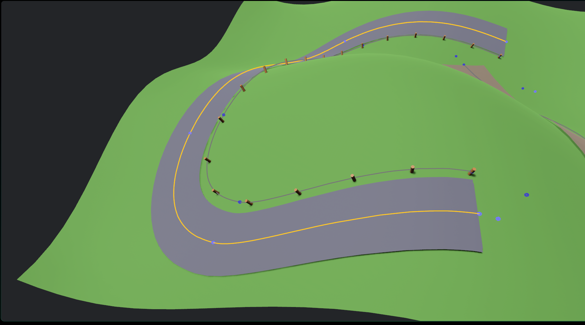

# bevy_spline_3d

A Bevy plugin for 3D spline editing with interactive gizmos. 

## Features

- **Multiple spline types**: Cubic Bezier, Catmull-Rom, B-Spline
- **Interactive editing**: Click and drag control points with visual gizmos
- **Road generation**: Extrude cross-section meshes along splines
- **Road intersections**: Connect multiple roads at intersection points
- **Object distribution**: Place objects along splines with configurable spacing
- **Path following**: Animate entities along spline paths
- **Surface projection**: Project roads and objects onto terrain using physics raycasting
- **Serialization**: Compatible with Bevy's scene system

## Quick Start

```rust
use bevy::prelude::*;
use bevy_spline_3d::prelude::*;

fn main() {
    App::new()
        .add_plugins(DefaultPlugins)
        .add_plugins(SplinePlugin)
        .add_plugins(SplineEditorPlugin)
        .add_plugins(CameraPlugin)
        .add_systems(Startup, setup)
        .run();
}

fn setup(mut commands: Commands) {
    // Camera with orbit controls
    commands.spawn((
        Camera3d::default(),
        Transform::from_xyz(0.0, 5.0, 10.0).looking_at(Vec3::ZERO, Vec3::Y),
        OrbitCamera::default(),
        FlyCamera::default(),
    ));

    // Spawn a spline
    commands.spawn(Spline::new(
        SplineType::CatmullRom,
        vec![
            Vec3::new(-3.0, 0.0, 0.0),
            Vec3::new(-1.0, 2.0, 0.0),
            Vec3::new(1.0, -1.0, 0.0),
            Vec3::new(3.0, 1.0, 0.0),
        ],
    ));
}
```

## Plugins

| Plugin | Description |
|--------|-------------|
| `SplinePlugin` | Core spline functionality (required) |
| `SplineEditorPlugin` | Interactive editing with gizmos and hotkeys |
| `SplineRoadPlugin` | Generate road meshes along splines |
| `SplineDistributionPlugin` | Distribute entities along splines |
| `SplineFollowPlugin` | Animate entities following spline paths |
| `SurfaceProjectionPlugin` | Project roads/objects onto terrain |
| `CameraPlugin` | Orbit and fly camera controls |

## Editor Hotkeys

| Key | Action |
|-----|--------|
| `Left Click` | Select control point |
| `Shift + Click` | Add to selection |
| `A` | Add control point after selection |
| `X` | Delete selected control point |
| `Tab` | Cycle spline type |
| `C` | Toggle closed/open spline |
| `F` | Toggle fly/orbit camera |
| `Escape` | Deselect all |

## Examples

```bash
# Interactive editor
cargo run --example editor

# Road generation
cargo run --example road

# Road intersections
cargo run --example intersection

# Object distribution
cargo run --example distribution

# Path following animation
cargo run --example path_follow

# Surface projection (requires terrain)
cargo run --example surface_projection
```

## Surface Projection

Roads and distributed objects can conform to terrain using the `SurfaceProjection` component:

```rust
commands.spawn((
    SplineRoad::new(spline, segment_mesh),
    SurfaceProjection::new()
        .with_ray_offset(20.0)
        .with_normal_offset(0.1),
));
```

This uses physics raycasting (via avian3d) to project geometry onto surfaces while preserving cross-section profiles and applying terrain camber.

## License

Licensed under either of Apache License, Version 2.0 or MIT license at your option.
